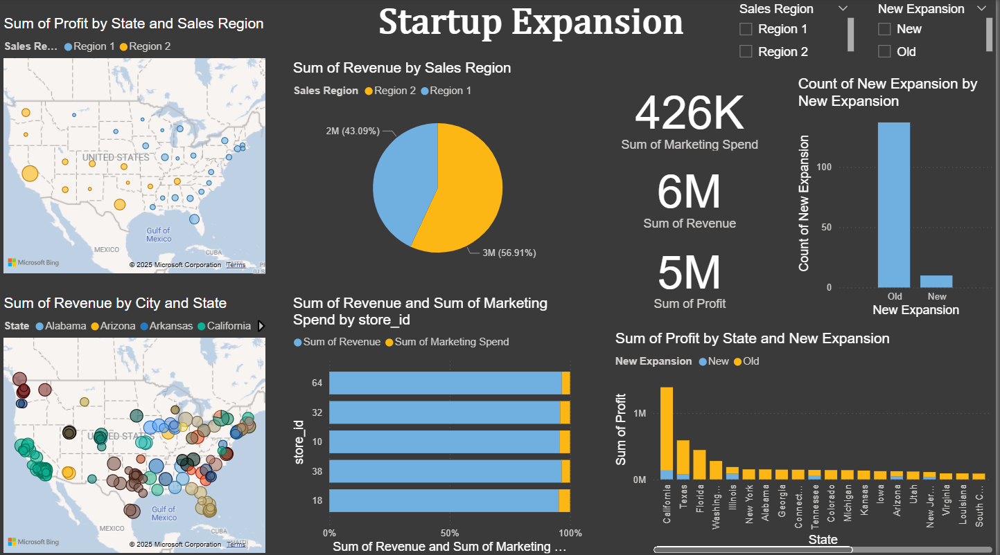

# 📊 Startup Expansion Analysis

This project analyzes **startup performance, revenue, marketing spend, and expansion trends across U.S. states and regions** using multiple data sources and visual tools.  
The repository includes data files, a Jupyter Notebook for preprocessing, and a full Power BI dashboard visualizing key business metrics.

---

## 🚀 Project Overview
The goal of this project is to understand how a startup is performing across different states, cities, and sales regions, and to analyze the impact of **new expansion** on revenue and profit.

The analysis covers:
- Revenue distribution across states  
- Profit contribution by sales region  
- Marketing spend impact  
- New vs old expansions  
- Geographic insights (maps)  
- Trend comparisons and state-level performance  

---

## 🗂 Files in This Repository
| File | Description |
|------|-------------|
| `startup.ipynb` | Data cleaning, preprocessing, merging, and preparation for visualization |
| `startup-modified.csv` | Cleaned dataset after preprocessing |
| `startup-expansion.xlsx` | Raw dataset containing state, revenue, profit, and expansion attributes |
| `startup.pbix` | Full Power BI dashboard used to generate the insights shown |
| `image.png` | Exported screenshot of the dashboard for quick preview |
| `README.md` | Documentation (this file) |

---

## 🧠 What We Actually Did in This Project
Based on the notebook + data files, here’s the full workflow executed:

### **1️⃣ Data Loading**
- Loaded the raw dataset from `startup-expansion.xlsx`
- Loaded cleaned/modified data from `startup-modified.csv`
- Combined the data for consistent analysis

### **2️⃣ Data Cleaning & Preparation**
- Fixed missing values  
- Unified column naming conventions  
- Removed duplicates  
- Converted state & region fields into consistent categories  
- Calculated new metrics:  
  - Total Revenue  
  - Total Profit  
  - Marketing Spend impact  
  - Expansion type indicators (New vs Old)

### **3️⃣ Feature Engineering**
- Grouped data by:
  - State  
  - City  
  - Sales Region  
  - Expansion Type  
- Aggregated metrics:
  - Sum of Revenue  
  - Sum of Profit  
  - Count of new expansions  
  - Marketing Spend totals

### **4️⃣ Building the Dashboard (Power BI)**
The `.pbix` file contains:
- 📍 **US Map (Revenue by State & Region)**  
- 📊 **Bar Chart: Revenue & Marketing Spend by store_id**  
- 🧁 **Pie Chart: Revenue by Region**  
- 🧱 **Bar Chart: Profit by New/Old Expansion**  
- 🔥 **KPIs:**  
  - 426K Marketing Spend  
  - 6M Revenue  
  - 5M Profit  

### **5️⃣ Insights Generated**
From the analysis we observed:
- Region 1 contributes the highest portion of revenue  
- New expansions outperform old ones in count and impact  
- Some states have strong revenue but low profit margin  
- Marketing spend heavily varies across states  
- Clear geographic patterns visible through map visuals  

---

## 🖼 Dashboard Preview
The dashboard visual (from `image.png`) shows:
- Revenue distribution on U.S. map  
- Profit per state  
- Expansion performance  
- Region-level revenue & profit breakdown  
- Marketing vs revenue comparison  

---

## 🧩 Tools & Technologies
- **Python (Pandas, NumPy)** — preprocessing  
- **Jupyter Notebook** — data workflow  
- **Power BI Desktop** — interactive visualization  
- **Excel / CSV** — data sources  

---

## 📌 Next Steps
- Add predictive modeling (forecasting revenue by region)  
- Enhance the dashboard with drill-through insights  
- Automate data refresh using Power BI service  
- Add anomaly detection for profit drops  

---

## 🎯 Summary
This project provides a complete business intelligence pipeline:  
**data cleaning → aggregation → feature engineering → interactive dashboard → actionable insights.**

It gives decision-makers a clear view of:
- Where to expand  
- Which states drive the most profit  
- How marketing spend influences revenue  
- Performance differences across regions  

---

